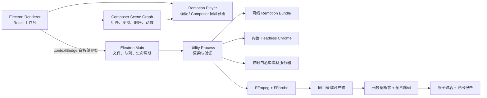

# Motioner 1.3 架构与数据格式

## 1. 设计原则

Motioner 以“同组件预览与导出、帧决定画面、Schema 驱动编辑、输出经过验证才落盘”为核心。应用面向 Apple Silicon macOS 与 Windows x64，完全本地运行。模板模式与 Composer 模式最终都进入同一个 Remotion Composition，两端共用同一套 UI、项目模型与渲染合同。

## 2. 进程与信任边界



- Renderer：没有 Node 集成；`contextIsolation`、Chromium sandbox 开启。只通过 preload 暴露项目、媒体、导出和 Finder API。
- Main：验证所有 IPC 的 Zod 输入，维护最近项目、自动保存与顺序任务队列。CPU 密集渲染不在 Main 中运行。
- Utility Process：加载离线 bundle，启动仅绑定回环地址且只暴露项目素材的临时服务器，调用 Remotion Renderer，再调用同包 FFprobe/FFmpeg 验证。
- 模板：纯 React/Remotion 代码，不接触 Electron、文件系统或 shell。
- Composer：组件 props 由 Zod Schema 约束；节点位置使用归一化坐标，动效仅由帧号、fps 和节点设置计算。模板也可作为冻结参数快照嵌入节点。

## 3. 工作区

| 位置 | 职责 |
|---|---|
| `packages/project-model` | 项目 Schema、分数帧率、画布、动画与时间码 |
| `packages/template-sdk` | Manifest 协议、字段类型、迁移、时长模型与校验 |
| `src/templates` | 22 个 Manifest、目录注册和运行时注册 |
| `src/remotion` | 共享原语、模板组件与根 Composition |
| `src/renderer` | 三栏编辑器、动态检查器、预览和队列 UI |
| `src/composer` | 15 个组件定义、16 个动效预设、场景校验和 Remotion 运行时 |
| `src/preload` | 白名单 IPC 桥 |
| `src/main` | 项目存储、日志、资产指纹、队列与渲染 Worker |
| `src/shared` | 主进程与界面共享合同、导出预设和空间估算 |

## 4. 项目格式

扩展名为 `.mfxproj`，格式版本为 2。核心结构：

```json
{
  "formatVersion": 2,
  "id": "UUID",
  "name": "项目名",
  "editorMode": "template",
  "template": {"id": "stat-counter", "version": "1.2.0"},
  "canvas": {
    "width": 1920,
    "height": 1080,
    "fps": {"numerator": 30000, "denominator": 1001},
    "durationInFrames": 150,
    "colorSpace": "rec709",
    "transparent": true
  },
  "props": {},
  "assets": [{"id": "UUID", "path": "/absolute/file.mov", "kind": "video", "fingerprint": "sha256", "proxyPath": "/cache/proxy.mp4", "thumbnailPath": "/cache/thumb.jpg", "durationSeconds": 12.5}],
  "typography": {"fontAssetId": "", "fallbackFamily": "system"},
  "animation": {"speed": 1, "reducedMotion": false, "edgeFrames": 18},
  "composition": {
    "backgroundColor": "transparent",
    "snapToGrid": true,
    "gridSize": 0.025,
    "nodes": [{
      "id": "UUID",
      "componentId": "title",
      "name": "标题",
      "transform": {"x": 0.2, "y": 0.4, "width": 0.6, "height": 0.18, "rotation": 0, "anchorX": 0.5, "anchorY": 0.5, "opacity": 1, "zIndex": 1},
      "timing": {"from": 0, "durationInFrames": 150},
      "motion": {"enter": "fade", "exit": "fade", "loop": "none", "enterDuration": 15, "exitDuration": 15, "intensity": 1},
      "props": {"text": "在这里输入标题", "fontSize": 96, "fontWeight": 720, "color": "#F4F7FB", "align": "left"},
      "hidden": false,
      "locked": false
    }]
  },
  "exportPresetId": "prores-4444",
  "exportOptions": {"conflictPolicy": "version"},
  "updatedAt": "ISO-8601"
}
```

宽高必须为偶数；帧率不使用浮点常量，而是保存分子/分母。项目上限是 8192×8192、216000 帧与 200 个 Composer 节点。项目写入采用“同目录临时文件 + rename”，避免写到一半损坏原项目。读取 v1 项目或恢复快照时会补入 `editorMode: template` 和空场景，再按 v2 Schema 校验。

模板具有独立语义版本。打开项目时 `upgradeProjectTemplate()` 沿 Manifest 迁移链升级 props，再用当前 Schema 解析。缺少迁移链、未知模板、字段非法或素材丢失都会形成可见错误，不静默丢数据。

## 5. 状态与持久化

- 项目正文：用户选择的 `.mfxproj`。
- 未命名项目恢复：`~/Library/Application Support/Motioner/recovery/active.mfxrecovery`。
- 最近项目：同一 userData 下的 `recent-projects.json`，最多 10 条。
- 日志：`logs/motioner.log`。
- 界面偏好：收藏、最近模板、参数预设与任务历史存入 Renderer localStorage；参数预设可导出为 JSON 再导回。

任务历史用于人类可读追踪，不把中断任务自动继续写盘；重启后原本 queued/rendering 的记录会显示为可重试错误，避免在用户不知情时恢复重型导出。

## 6. 渲染和输出状态机

```text
queued → preparing → rendering → encoding → validating → complete
                                                ↘ error / cancelled
```

Main 在入队前完成项目升级、模板或 Composer 场景校验、时长校验、必选素材校验、文件存在性校验和空间检查。模板节点的快照也会检查模板版本、参数、时长和素材。所有任务进入单并发 FIFO 队列，避免多路 4K 渲染争抢内存。活动任务取消消息直接发给 Worker；等待任务可从队列移除。

Worker 为每个任务创建唯一隐藏临时路径：视频为临时文件，PNG 为临时目录。渲染结束后：

1. FFprobe 解析首个视频流及音轨。
2. 对视频流写入 Rec.709 VUI/容器色彩标记。
3. 断言 codec、profile、pixel format、宽高、fps、帧数及 Rec.709 space/primaries/transfer 三项。
4. 断言动效文件没有意外音轨。
5. FFmpeg 解码整个成片到 null，发现尾帧损坏即失败。
6. 写入结构化导出报告。
7. 按自动版本、安全替换或跳过策略原子落盘。

取消或错误走 `finally` 清理临时路径；最终文件不会提前出现。

## 7. 编码合同

| 预设 | 容器/序列 | Codec / Profile | 像素格式 |
|---|---|---|---|
| ProRes 4444 | MOV | ProRes profile 4 | `yuva444p12le` |
| ProRes 4444 XQ | MOV | ProRes profile 5 | `yuva444p12le` |
| PNG 序列 | PNG | PNG | `rgba` |
| H.264 审看 | MP4 | H.264 High | `yuv420p` |

透明输出没有音轨。H.264 注入深色审看底，不承诺透明。所有视频都必须实测为 Rec.709 三项标记；导出报告记录实测结果，而不是只记录请求参数。

## 8. 离线打包

electron-builder 生成 macOS arm64 `.app` / DMG 与 Windows x64 NSIS 安装包。包内额外资源包括：

- 预构建的 `dist/remotion/index.html`。
- 与目标平台一致的 `chrome-headless-shell`。
- macOS 的 Remotion arm64 compositor、FFmpeg 和 FFprobe（asar unpack）。
- Windows 的 Remotion x64 compositor、FFmpeg 和 FFprobe（独立 `remotion-binaries` 资源目录）。

`scripts/verify-package.mjs` 对应用可执行文件、正式图标、离线浏览器、Remotion bundle 与渲染二进制检查存在性、权限、非空大小并计算 SHA-256；Windows `.exe` 还会校验 `MZ` PE 文件头。报告分别写入 `release/Motioner-integrity.json` 与 `release/Motioner-integrity-windows-x64.json`。当前包未签名和公证；公开分发需分别配置 Apple 公证与 Windows Authenticode 签名。

## 9. 扩展边界

新增内置模板只依赖 Template SDK，不需要改变导出器，脚手架负责生成骨架和注册点；新增基础组件则在 Composer 注册表中加入 Schema、默认值和渲染分支。未来原生 AVFoundation 编码器可以替换编码段，但应保持项目、场景、模板、队列与验证合同。外部模板包、模板商店、云渲染和任意脚本执行不属于 1.x 信任边界。
