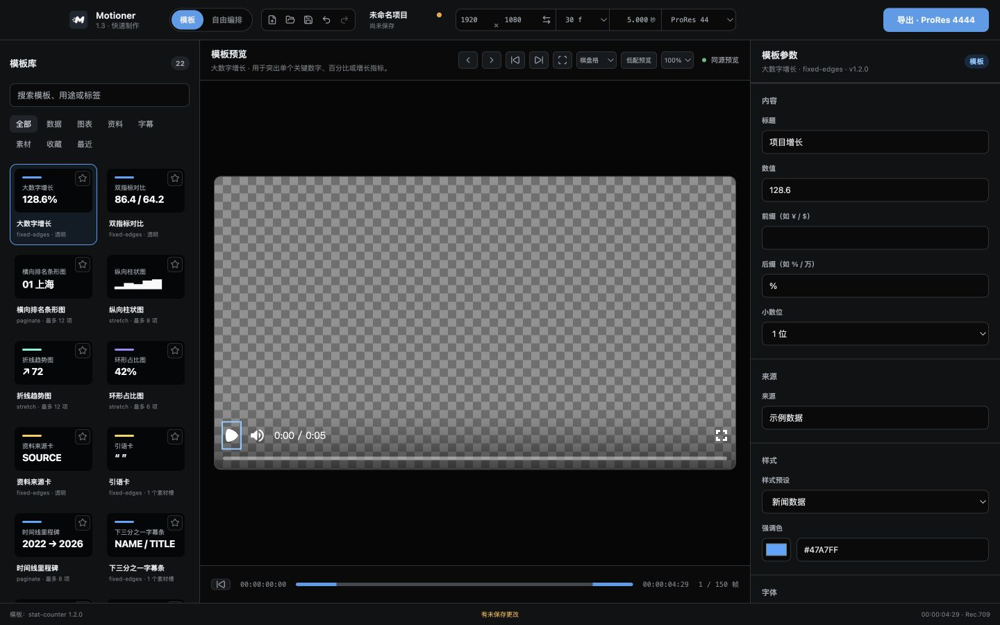
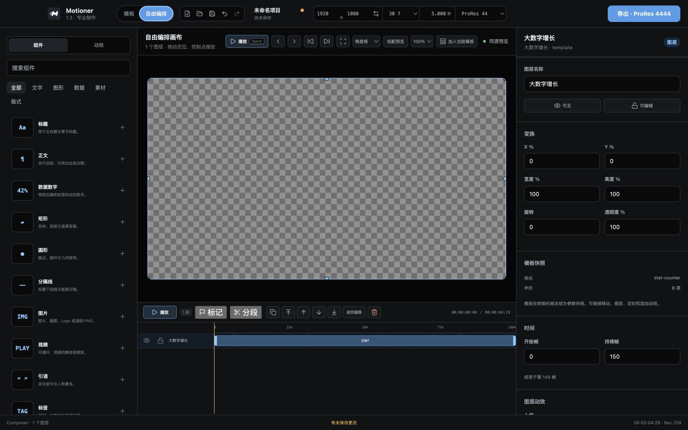

# Motioner UI 重构：阶段一完成报告

> 完成日期：2026-08-11
>
> 阶段范围：布局架构优化
>
> 当前状态：阶段一已完成并暂停；阶段二尚未开始。

## 1. 完成结果

阶段一已经把 Motioner 的现有功能重新组织为稳定、可辨识的桌面编辑器骨架：

- 顶部“模板 / 自由编排”模式切换永久显示，并提升到品牌后的全局导航位置。
- 当前模式使用胶囊 Tab 高亮；品牌副标题同步显示“快速制作 / 专业制作”。
- 工作区使用稳定三栏：左侧资源、中央制作、右侧调整。
- 1440px 默认窗口实测三栏为 288 / 792 / 360px，即 20% / 55% / 25%。
- 1280px 最小窗口实测三栏为 256 / 704 / 320px，无页面级横向溢出。
- 模板模式保持“模板库 / 预览 + 简化时间线 / 模板参数”。
- 自由编排保持“组件库 / 画布 + 完整时间线 / 图层属性”。
- 模板简化时间线固定为 54px；自由编排完整时间线固定为 236px，图层增加时只在时间线内部滚动。
- 画布工具栏保持单行稳定；最小窗口下控制项过多时，只在工具区内部横向滚动，不挤压画布或侧栏。
- 右侧检查器标题固定，属性内容独立滚动。

## 2. 修改文件

| 文件 | 修改内容 |
| --- | --- |
| `src/renderer/src/App.tsx` | 调整顶栏顺序和模式 Tab 语义；增加模式对应的品牌副标题；为 workbench 增加模式类；明确“模板预览 / 自由编排画布 / 模板参数 / 图层属性”区域身份 |
| `src/renderer/src/styles.css` | 建立受约束的 20% / 自适应 / 25% 三栏；固定两类时间线高度；稳定画布工具栏；侧栏独立滚动；检查器标题 sticky；修正 Composer 时间线工具栏挤压 |
| `docs/当前UI架构分析.md` | 记录当前入口、组件、状态、样式、两种模式、时间线、属性面板、复用现状和施工风险 |
| `docs/stage-1-screenshots/template-mode.jpg` | 1440×900 模板模式验证截图 |
| `docs/stage-1-screenshots/composer-mode.jpg` | 1440×900 自由编排模式验证截图 |
| `docs/HANDOFF.md` | 同步阶段一进展、验证结果、安装包和后续边界 |
| `release/Motioner-1.3.1-arm64.dmg` | 重新打包的阶段一可测试安装包 |
| `release/Motioner-integrity.json` | 重新生成的包内离线资源完整性清单 |
| `release/SHA256SUMS.txt` | 更新 1.3.1 DMG 的 SHA-256 |

## 3. 截图

### 模板模式

结构对应：左侧模板库，中间模板预览与固定简化时间线，右侧模板参数。

### 自由编排模式

结构对应：左侧组件/动效库，中间可交互画布与固定完整时间线，右侧图层属性。

## 4. 验证结果

### 自动检查

- `pnpm check`：通过。
- ESLint：通过。
- TypeScript：通过。
- Vitest：22 个测试文件 / 61 项测试通过。
- `pnpm build`：通过。

### 真实导出冒烟

`pnpm test:exports` 通过：

- ProRes 4444：通过，RGBA/Rec.709/60 帧。
- ProRes 4444 XQ：通过，RGBA/Rec.709/60 帧。
- PNG 序列：通过，RGBA/60 帧。
- H.264 审看版：通过，Rec.709/60 帧。
- H.264 多文件分段：通过，3 段/60 帧，并验证 `sections.json`。

### 打包应用验证

- `pnpm package:dmg`：通过。
- 包内离线资源完整性：8 个关键文件通过。
- 打包应用 E2E：H.264 3 段/75 帧通过。
- `hdiutil verify`：DMG 校验有效。
- 安装包：`release/Motioner-1.3.1-arm64.dmg`。
- 文件大小：274,275,713 bytes。
- SHA-256：`8ee1e7d2cd8dbd50b79916194a068db06ae0e6d53d64ec070b3107188048068d`。

### 布局实测

| 窗口 | 左栏 | 中栏 | 右栏 | 模板时间线 | Composer 时间线 | 页面横向溢出 |
| --- | ---: | ---: | ---: | ---: | ---: | --- |
| 1440×900 | 288px | 792px | 360px | 54px | 236px | 无 |
| 1280×760 | 256px | 704px | 320px | 54px | 236px | 无 |

Renderer 控制台未发现 error/warning 日志。

## 5. 当前问题与保留项

1. 当前 macOS 在截图时处于锁屏状态，自动化无法直接读取原生 Electron 窗口；本报告截图来自同一 Electron renderer 的开发地址，使用 Electron 默认窗口尺寸 1440×900。原生标题栏未纳入截图，但完整打包应用 E2E 已通过。
2. 自由编排模式在 1280px 最小窗口下，中央画布工具控制项总宽度大于可用宽度；当前采用工具区内部横向滚动，主布局不会跳动。阶段三可再做快捷操作优先级与收纳。
3. 模板和 Composer 属性区仍为全部展开的长列表。折叠分组属于阶段二，未提前实施。
4. 模板模式仍展示字体、动画、工作流和完整输出规格。隐藏复杂参数和强化快速导出路径属于阶段三，未提前实施。
5. 计划中的精确色值、统一圆角/边框/间距、卡片视觉和禁止大阴影属于阶段二，本阶段保持既有视觉 token。
6. 参考图中的任意关键帧编辑没有对应的现有数据模型。受“禁止修改数据模型/动画计算逻辑”限制，阶段三如继续，只能先优化现有动效预设、时序和标记交互；任意关键帧能力需要单独确认范围。

## 6. 未修改范围

本阶段没有修改：

- 项目数据模型。
- 项目文件格式。
- 模板数据结构。
- 导出逻辑和分段逻辑。
- 动画计算逻辑。
- Remotion composition 输入契约。
- 节点选择、移动、缩放、时间线裁剪和分段点拖拽逻辑。

## 7. 下一步

等待阶段一确认。收到确认前不执行阶段二。

阶段二若获确认，将只推进视觉系统：指定色彩、组件圆角/边框/间距统一、模板卡片信息层级、属性面板折叠分组；不会提前进入阶段三交互效率改造。
