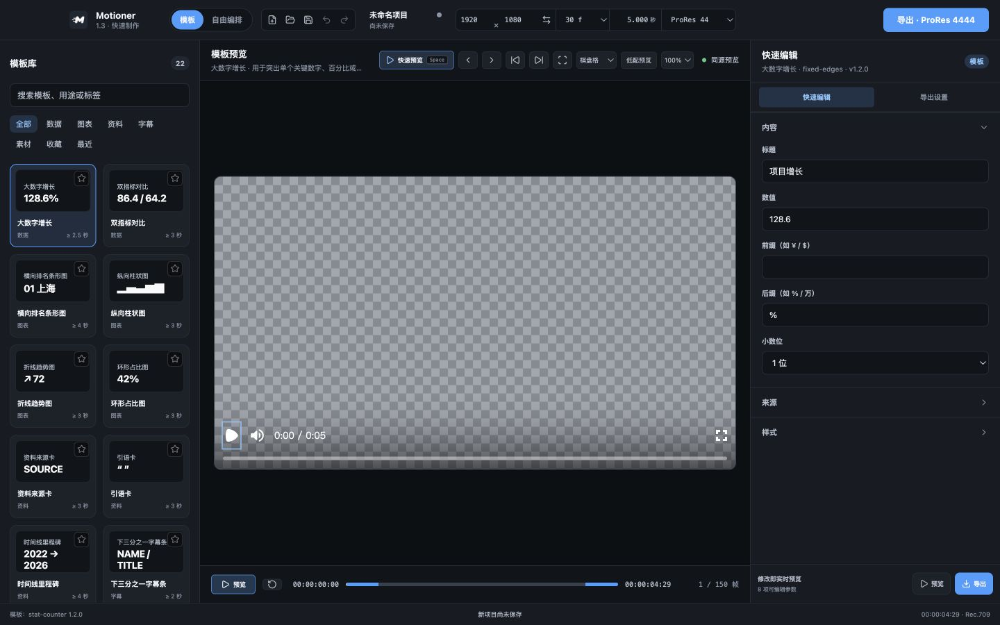
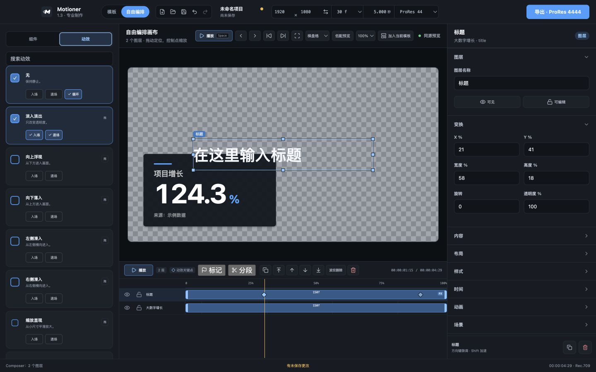
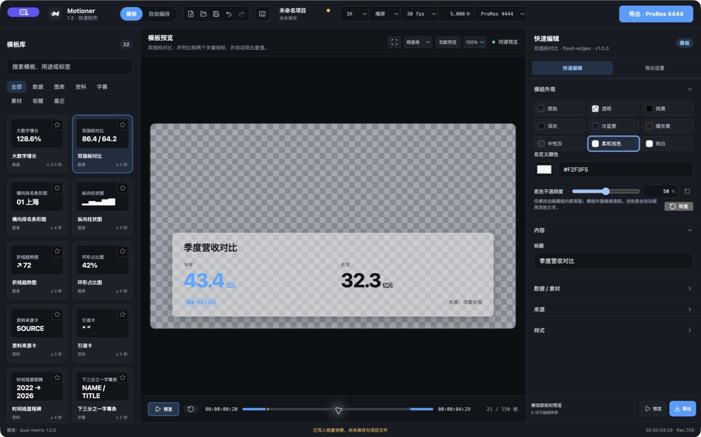
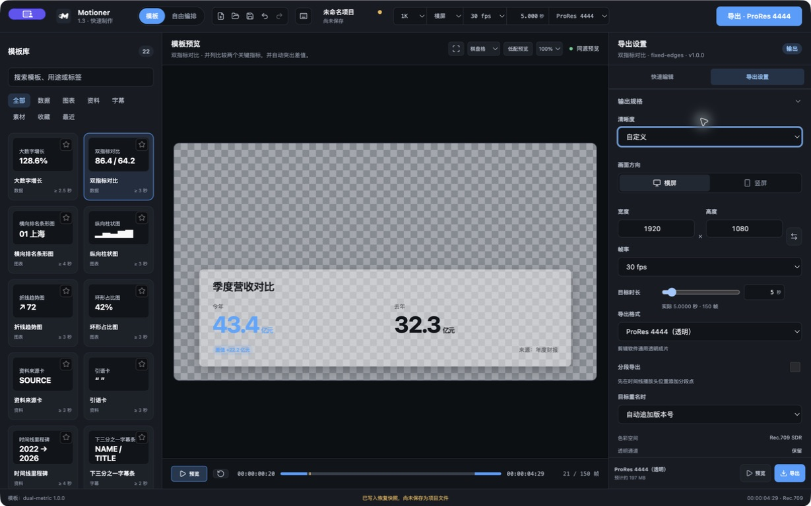
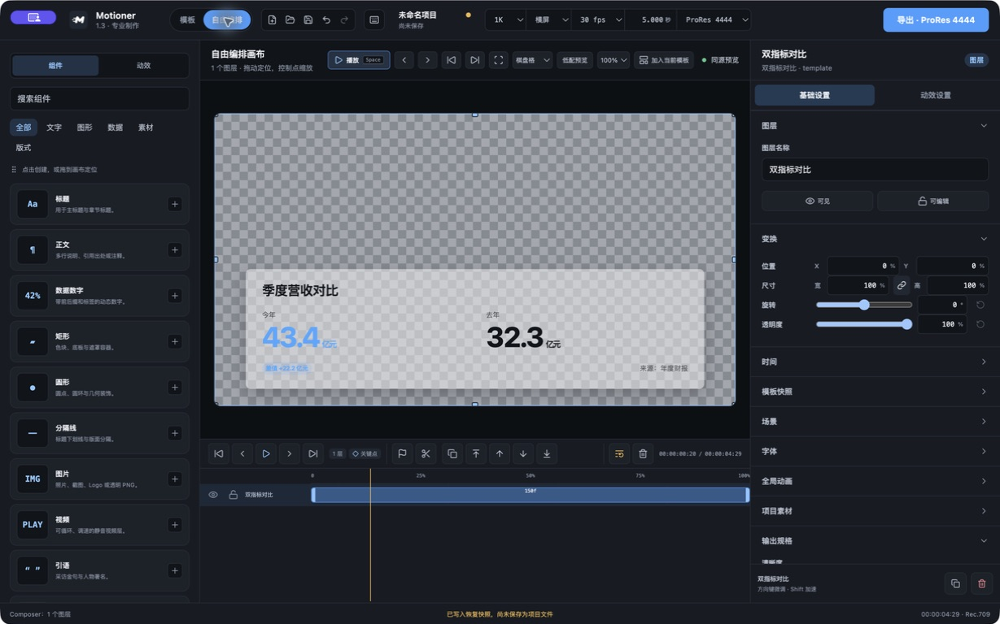
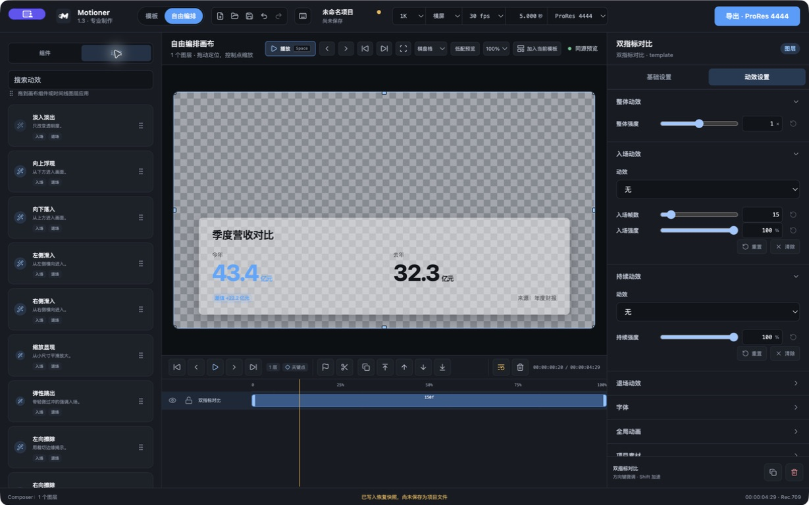
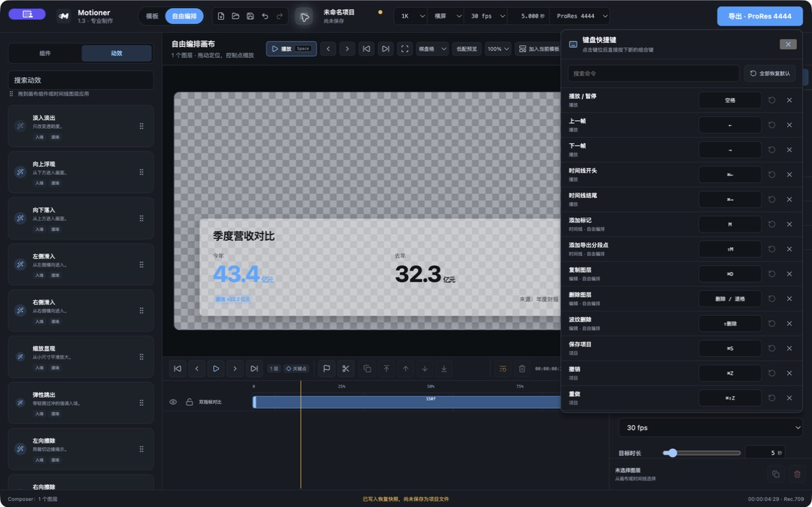

# Motioner UI 重构：阶段三完成报告

> 完成日期：2026-08-11
>
> 阶段范围：交互效率与稳定布局优化
>
> 当前状态：阶段三及实测问题修订已完成，已生成可验收 DMG。

## 1. 完成结果

阶段三在阶段一布局和阶段二视觉系统基础上，完成了两种模式的任务流收敛：

- 模板模式聚焦“选择模板 → 快速修改 → 快速预览 → 导出”。
- 自由编排聚焦“选择/拖入组件 → 画布定位 → 时间线编辑 → 属性调整”。
- 右侧检查器改为固定标题、独立滚动内容和固定底部动作，内容多少不再推动主要按钮。
- 时间线、三栏和画布均保持既有固定尺寸规则；长文本与窗口缩小时仅省略或局部滚动。
- 轻量动效仅用于折叠内容、Tab 状态和按钮反馈，并保留 `prefers-reduced-motion` 降级。
- 未修改项目数据结构、模板结构、文件格式、导出逻辑或 Remotion 动画计算。

## 2. 模板模式效率优化

### 快速编辑 / 导出设置

模板检查器新增两个明确的工作 Tab：

- “快速编辑”只显示 manifest 声明的用户内容、数据、来源、布局、样式和动画字段。
- “导出设置”收纳画布规格、帧率、时长、导出格式、字体、全局动画、预设、素材和批量生成等低频项目级设置。
- 输出规格在“导出设置”中始终位于最前并默认展开。
- 复杂项目工具不再占据模板默认编辑路径。

### 快速预览

- 画布工具栏的播放按钮在模板模式明确标为“快速预览”。
- 简化时间线增加预览/暂停、从头播放、可拖播放头、当前/总时码和帧数。
- 右侧底部固定“预览”按钮，可随时从头回放当前模板。

### 快速导出

- 右侧底部固定“导出”主按钮，不随属性数量或滚动位置移动。
- 按钮沿用现有 `startRender()`、校验状态和禁用原因，没有新增导出分支。
- “导出设置”显示当前格式、预计空间、透明通道和分段输出摘要。

## 3. 自由编排效率优化

### 组件拖入

- 15 个组件卡片均支持点击创建与 HTML5 拖入。
- 拖入画布时显示十字落点和“在此创建”反馈。
- 新组件以落点为中心定位，并限制在画布边界内。
- 点击卡片仍保留原有“在画布中央创建”行为。

### 图层管理

- 时间线继续固定显示可见/隐藏、锁定/解锁、复制、层级调整、波纹删除和删除。
- 右侧底部增加固定的当前图层摘要、复制和删除按钮。
- 图层名、状态栏、项目名和操作摘要统一省略长文本，不允许撑开三栏。
- 检查器底部按钮位于既有 `.inspector-panel` 选中保留区内，不会触发先清空选中的竞态。

### 动效关键点

- 时间线素材条用统一蓝色菱形显示已有入场结束点和退场开始点。
- 拖动菱形会直接调整现有 `motion.enterDuration` / `motion.exitDuration`。
- 拖动过程沿用预览 composition、播放头同步、吸附与 Alt 临时取消吸附；松开后才提交。
- 这不是新的任意属性关键帧数据模型，不改变动画算法。

## 4. 稳定布局规则

- 右侧检查器采用固定头部、局部滚动和 56px 固定动作区。
- 模板时间线固定 54px，Composer 时间线固定 236px。
- 左侧资源、右侧属性和时间线轨道分别独立滚动。
- 画布工具栏和时间线工具栏在空间不足时仅局部横向滚动。
- 所有动态标题、图层名、状态、路径和摘要均设置 `min-width: 0`、省略或固定宽度。
- 1280×760 下页面无横向或纵向溢出。

## 5. 修改文件

| 文件 | 修改内容 |
| --- | --- |
| `src/renderer/src/App.tsx` | 模板检查器任务 Tab、固定动作区、快速预览时间条、拖入落点创建接线 |
| `src/renderer/src/ComponentLibrary.tsx` | 组件卡片拖动语义、拖动状态和操作提示 |
| `src/renderer/src/ComposerCanvasOverlay.tsx` | 组件拖入识别、落点反馈和归一化坐标 |
| `src/renderer/src/ComposerTimeline.tsx` | 可拖动效关键点、图层时间线提示与提交预览流程 |
| `src/renderer/src/composer-interaction.ts` | 组件落点居中及画布边界约束 helper |
| `src/renderer/src/composer-interaction.test.ts` | 中央、四边落点定位单测 |
| `src/renderer/src/timeline-interaction.ts` | 动效边界帧到现有时长字段的换算 helper |
| `src/renderer/src/timeline-interaction.test.ts` | 动效关键点换算与边界单测 |
| `src/renderer/src/styles.css` | 固定检查器、快速时间条、拖入反馈、关键点和稳定溢出样式 |
| `docs/stage-3-screenshots/` | 模板和自由编排模式 1440×900 截图 |
| `docs/HANDOFF.md` | 同步阶段三实现、验证和交付状态 |

## 6. 截图

### 模板模式

右侧默认只展示快速编辑字段；预览时间条和底部预览/导出按钮均固定在工作区边缘。

### 自由编排模式

动效库、画布选择框、固定时间线、图层状态和可拖菱形关键点组成完整的专业编排路径。

## 7. 验证结果

### 自动检查

- `pnpm check`：通过。
- ESLint：通过。
- TypeScript：通过。
- Vitest：26 个测试文件 / 75 项测试通过。
- Impeccable UI 反模式检测：0 项。

### 真实界面与交互

- 1440×900：模板和自由编排截图通过。
- 1280×760：三栏实测 256 / 704 / 320px，页面 X/Y 溢出均为 0。
- Composer 时间线实测固定 236px；右侧动作区在两种模式均与面板底边完全对齐。
- 模板极端长标题替换前后，画布和动作区的 `left/top/width/height` 完全一致。
- “导出设置”中输出规格视觉顺序为第一项并默认展开。
- 15/15 组件卡具有拖入语义；落点居中及四边约束单测通过。
- 动效关键点真实拖动从 15 帧更新到 45 帧，时间线与检查器选中保持正常。
- 模板底部“预览”按钮可启动播放；快速编辑/导出 Tab 状态正确。
- Renderer warning/error 日志：0 项。

### 真实导出与安装包

- `pnpm test:exports`：ProRes 4444、ProRes 4444 XQ、PNG 序列、H.264 整片和 H.264 三段导出全部通过。
- `pnpm package:dmg`：通过。
- 包内离线资源完整性：8 个关键文件通过。
- 打包应用 E2E：H.264 3 段 / 75 帧通过。
- `hdiutil verify`：DMG 有效。
- 安装包：`release/Motioner-1.3.1-arm64.dmg`。
- 文件大小：274,244,601 bytes。
- SHA-256：`017379eaa3d840ea47bc1789a46b60d55d6ee1cee4aef8213a5d0f3ee7e674cf`。

## 8. 当前问题与边界

1. 任意属性关键帧仍需要新的项目数据契约，本阶段严格遵守限制，只允许时间线编辑已有入场/退场时长。
2. 应用内浏览器的坐标拖动驱动未能合成原生 HTML5 `DragEvent`，因此组件拖入以 15/15 DOM 可拖语义、画布 drop handler、落点 helper 单测和点击创建回归兜底；建议最终验收时在 DMG 中手动拖入一个组件确认原生桌面手感。
3. 左侧资源库在小窗口或大量内容时保持内部滚动，这是稳定布局的预期行为。
4. 原生 `<select>` 菜单继续使用 macOS 系统样式。

## 9. 未修改范围

本轮没有修改模板字段 Schema、导出文件格式、编码/队列逻辑或动画计算。唯一契约扩展是项目级可选 `templateAppearance`；旧项目缺失时自动补默认值，模组外观随项目保存并进入预览与真实导出。

## 10. 验收建议

1. 模板模式修改标题后点击右下“预览”，再切到“导出设置”。
2. 自由编排从左侧把“标题”拖到画布右上区域，确认按落点创建。
3. 切换到“动效”，给标题应用淡入淡出并拖动时间线两个菱形。
4. 输入很长的图层名，确认画布、时间线和底部按钮不移动。
5. 使用顶部或右下导出按钮执行一次 H.264 审看导出。

## 11. 实测问题修订（2026-08-11）

用户完成阶段三首轮实测后，本轮按确认方案完成以下修订：

- 模板只保留下方播放控制；点击模板画面从首帧播放一次，原生 Player 控制层、进度条和循环关闭。
- 新增动画模组底色预设、自定义 HEX、最近颜色和不透明度；浅色表面自动切换深色文字，模组外围透明保持不变。
- 顶栏改为 1K / 2K / 4K + 横竖屏；导出设置增加可实际进入的自定义宽高模式。
- 连续数值统一为紧凑滑块 + 数字输入；自由编排检查器拆为「基础设置 / 动效设置」，模板快照后置。
- 动效库移除勾选和点击应用，使用 Lucide 动效图标与拖放入口；右侧按入场、持续、退场分组编辑。
- 时间线运输、标记、分段、图层顺序和删除操作统一为 30px Lucide 工具按钮，并按桌面剪辑顺序分组。
- 新增集中快捷键命令表、冲突检测、搜索、录入、清除和重置；实机验证 `← / →` 逐帧与 `⌘← / ⌘→` 首尾跳转。

### 实测截图

### 最终验证

- `pnpm check`：lint、TypeScript、26 个测试文件 / 75 项测试通过。
- `pnpm test:exports`：两种 ProRes、PNG RGBA、H.264 整片和 H.264 三分段全部通过。
- `pnpm package:dmg`：构建、离线资源完整性、包内应用 H.264 三分段 / 75 帧 E2E 全部通过。
- `hdiutil verify`：`release/Motioner-1.3.1-arm64.dmg` 有效。

阶段三及本轮实测修订已完成，等待用户对新 DMG 做最终手感验收。

## 12. 实测问题修订（三）（2026-08-11）

本轮继续处理顶栏、检查器与桌面应用质感问题：

- 清晰度和横竖屏改为独立焦点容器；统一下拉按实际内容收紧宽度并居中锚定。
- 右侧短枚举字段改为左标签、右控件；每个动效分组使用独立底部动作区承载重置和清除。
- 左上品牌只保留图标和名称；项目名称支持直接编辑。
- dirty 退出确认替换为 Motioner 风格的应用内模态弹窗，并保留安全的保存握手。
- 顶栏控件统一尺寸与间距；全局按钮新增延迟悬停名称提示。
- 所有具有默认值的滑块支持双击重置，模板和组件参数分别读取自身默认值。

### 验证结果

- `pnpm check`：ESLint、TypeScript、30 个测试文件 / 84 项测试通过。
- 真实 Electron：焦点隔离、菜单定位、项目重命名、检查器布局、滑块重置与退出取消路径通过。
- `pnpm test:exports`：两种 ProRes、PNG RGBA、H.264 整片和 H.264 三分段通过。
- `pnpm package:dmg`：8 项离线完整性和打包应用 H.264 三分段 / 75 帧 E2E 通过。
- `hdiutil verify`：DMG 有效。
- 安装包：`release/Motioner-1.3.1-arm64.dmg`，274,255,266 bytes。
- SHA-256：`3a7c9f4c58cbb33b095a26fa9e944f5d0ac9b90ac2a77961b3d5f1cf35309901`。

## 13. 导出队列与退出弹窗补漏（2026-08-12）

- 导出队列标题右侧统一放置“在 Finder 显示 / 清除记录”两个标准按钮，Finder 在左；条目内不再重复展示 Finder 动作。
- 退出弹窗三个按钮等宽等高。
- 修复透明画布交互层高于模态层导致按钮不可点击的问题，模态层现在稳定覆盖全部编辑交互层。
- 真实 Electron 逐项验证取消退出、Finder 定位和清除记录；完整自动检查、五类真实导出、package E2E 与 DMG 校验通过。
- 最新安装包：`release/Motioner-1.3.1-arm64.dmg`，274,255,680 bytes。
- SHA-256：`8f022274ac8d94a67b1d1898a7545eda7562df5153fe5b0d50cd0aad88ae10c6`。
