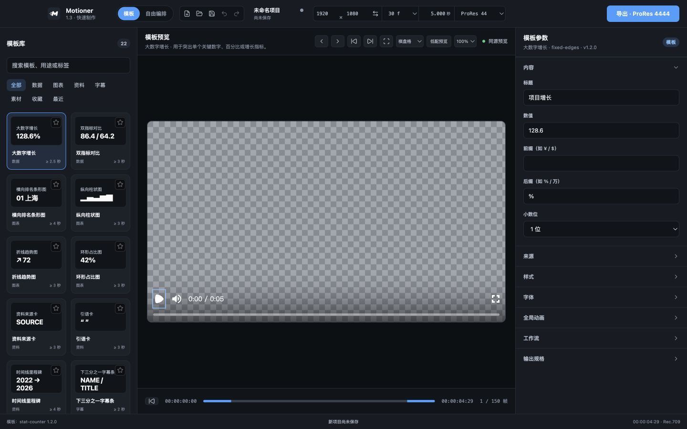
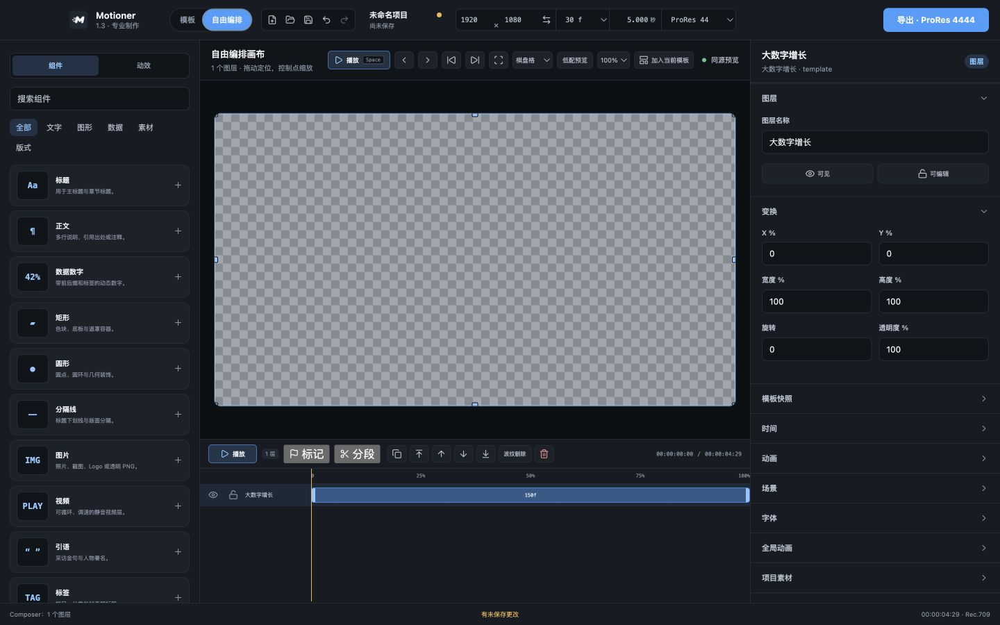

# Motioner UI 重构：阶段二完成报告

> 完成日期：2026-08-11
>
> 阶段范围：视觉系统优化
>
> 当前状态：阶段二已完成并暂停；阶段三尚未开始。

## 1. 完成结果

阶段二已在阶段一稳定布局上建立统一的 Motioner 桌面视觉系统：

- 应用背景：`#111418`。
- 面板背景：`#171B22`。
- 结构边框：`#252B35`。
- 主强调色：`#409EFF`。
- 补充了表面层级、文字层级、语义色、圆角和状态过渡 token。
- 按钮、输入框、选择框、Tab、卡片和面板统一使用克制的边框、圆角与状态反馈。
- 移除渲染队列浮层的大范围阴影，只保留结构边框。
- 模板库保持两列卡片，并明确展示缩略图、名称、模板类型和最低时长。
- 模板参数、节点属性及项目级设置统一改为可折叠分组。
- 导出进度条由 `width` 动画改为合成层 `scale` 动画，避免布局重算。

## 2. 视觉 token

| 角色 | 值 | 用途 |
| --- | --- | --- |
| Background | `#111418` | 应用背景、控件深层背景 |
| Panel | `#171B22` | 顶栏、左右侧栏、属性分组 |
| Surface 2 | `#1C2129` | 卡片、次级按钮、输入容器 |
| Surface 3 | `#212832` | 悬停和选中层级 |
| Border | `#252B35` | 默认结构边框 |
| Border Strong | `#36404D` | 悬停和高优先级边界 |
| Accent | `#409EFF` | 主按钮、当前模式、选中状态 |
| Ink | `#F2F5F9` | 主文字 |
| Muted | `#B6C0CE` | 次级文字和标签 |
| Quiet | `#8995A6` | 辅助说明和元数据 |

色彩策略为“深色中性层级 + 单一蓝色强调”，强调色仅用于主操作、当前选择和状态，不作装饰性铺色。

## 3. 模板卡片

模板库继续使用两列布局，每张卡片现在包含：

- 16:9 缩略预览。
- 模板名称。
- 用户可理解的类型：数据、图表、资料、字幕或素材。
- 基于模板最短帧数换算的最低时长，例如 `≥ 2.5 秒`。
- 收藏按钮和当前模板边框状态。

卡片默认使用面板表面和 1px 边框，不使用阴影；悬停只提升背景与边框，选中时使用 `#409EFF`。

## 4. 属性面板折叠分组

新增复用组件 `InspectorGroup`，提供：

- 明确的分组标题和 Chevron 状态图标。
- `aria-expanded` / `aria-controls` 可访问性语义。
- 每个分组独立展开或折叠。
- 只管理 UI 展示状态，不修改项目数据。
- 点击折叠标题仍处于 `.inspector-panel` 保留区，不会清空 Composer 节点选择。

模板模式默认只展开“内容”，其余按实际 manifest 展示为可折叠的来源、布局、样式、动画等分组。

自由编排默认展开“图层”和“变换”，并提供模板快照、内容、布局、样式、时间、动画、场景、字体、全局动画、项目素材和输出规格等折叠分组。

## 5. 修改文件

| 文件 | 修改内容 |
| --- | --- |
| `src/renderer/src/InspectorGroup.tsx` | 新增通用可折叠属性分组组件 |
| `src/renderer/src/Inspector.tsx` | 模板 manifest 字段改用折叠分组，调整分组顺序 |
| `src/renderer/src/ComposerInspector.tsx` | 图层、变换、组件字段、时间和动画改用折叠分组 |
| `src/renderer/src/App.tsx` | 场景、字体、全局动画、工作流、素材、批量生成和输出规格改用折叠分组 |
| `src/renderer/src/TemplateLibrary.tsx` | 模板卡片增加类型和最低时长，改善语义结构 |
| `src/renderer/src/RenderQueuePanel.tsx` | 导出进度改用 CSS scale 变量 |
| `src/renderer/src/styles.css` | 建立阶段二 token、统一控件/卡片/Tab/面板样式、折叠组样式、移除大阴影 |
| `docs/stage-2-screenshots/` | 模板和自由编排模式 1440×900 验证截图 |
| `docs/HANDOFF.md` | 同步阶段二实现与验证结果 |

## 6. 截图

### 模板模式

两列模板卡片已显示类型与最低时长；右侧仅默认展开内容参数，其余分组保持清晰可发现。

### 自由编排模式

左侧组件列表、中央画布/时间线与右侧折叠属性组共享统一表面、边框和状态语言。

## 7. 验证结果

### 自动检查

- `pnpm check`：通过。
- ESLint：通过。
- TypeScript：通过。
- Vitest：22 个测试文件 / 61 项测试通过。
- `pnpm build`：通过。
- Impeccable UI 反模式检测：0 项。

### 界面与交互

- 1440×900：模板和自由编排模式截图验证通过。
- 1280×760：三栏为 256 / 704 / 320px，无页面横向溢出。
- 模板卡片网格：两列，22 张卡片均包含类型与时长元数据。
- 折叠交互：`aria-expanded` 正确变化，展开内容可见。
- Composer 节点选择：点击动画等属性分组后保持选中。
- Renderer 日志：无 warning/error。

### 对比度

| 组合 | 对比度 | 结果 |
| --- | ---: | --- |
| 主文字 / 面板 | 15.79:1 | AAA |
| 次级文字 / 面板 | 9.39:1 | AAA |
| 辅助文字 / 面板 | 5.68:1 | AA |
| 强调色 / 面板 | 6.21:1 | AA |

### 真实导出与安装包

- `pnpm test:exports`：ProRes 4444、ProRes 4444 XQ、PNG 序列、H.264 整片、H.264 三段导出全部通过。
- `pnpm package:dmg`：通过。
- 包内离线资源完整性：8 个关键文件通过。
- 打包应用 E2E：H.264 3 段 / 75 帧通过。
- `hdiutil verify`：DMG 校验有效。
- 安装包：`release/Motioner-1.3.1-arm64.dmg`。
- 文件大小：274,272,646 bytes。
- SHA-256：`eb9ff8e2d54f4d9088d04f1796c133a3468103a5a5d050df8c3c09ecf9c9d323`。

## 8. 当前问题与保留项

1. 系统中已运行的 `/Applications/Motioner.app` 占用了 Electron 单实例锁，因此开发进程无法展示当前源码窗口；截图来自同一 renderer 的 1440×900 开发界面。重新打包后的应用已通过完整性检查和打包应用 E2E。
2. 模板模式仍保留字体、全局动画、工作流和输出规格入口，只是默认折叠。进一步隐藏复杂参数和强化快速修改/预览/导出属于阶段三。
3. 自由编排的图层操作、组件拖入和时间线效率尚未做阶段三强化。
4. 任意属性关键帧仍没有数据模型支持；本阶段没有增加视觉占位或伪功能。
5. 原生 `<select>` 展开的系统菜单继续使用 macOS 标准样式，这是有意保留的桌面平台行为。

## 9. 未修改范围

本阶段没有修改项目模型、文件格式、模板结构、导出逻辑、动画计算逻辑或 Remotion composition 输入契约。

## 10. 下一步

等待阶段二确认。收到确认前不执行阶段三。

阶段三若获确认，将聚焦模板快速修改/预览/导出、自由编排图层与时间线操作，以及文字/数据变化下的稳定布局规则。
